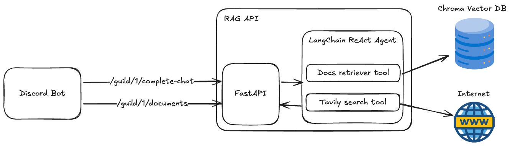

# rag-api

## Repositories

- [bot](https://github.com/seg-org/rag-bot)
- [api](https://github.com/seg-org/rag-api)

Making a bot that can **leverage documents** with **RAG** to generate relevant responses.

## Design

### Discord Bot
- /add-text: Adds text to the vector database knowledge base.
- /add-web: Adds web page (you input the url, the API will load data from that page) to the vector database knowledge base.
- /toggle-web-search: Toggles whether the bot should search the web for data when it can't find any in the vector database.

Note: the requests the bot makes to the API have guild IDs in the url params in order to keep track of the loaded documents for each guild **separately**.

### FastAPI
acts as an interface between the Discord bot and the Langchain ReAct Agent

### LangChain ReAct Agent
To be precise, ReAct Agents are from LangGraph library, which is a part of LangChain. ReAct Agents find answers to queries using the tools we provided: Docs retriever tool and Tavily search tool.
- Docs retriever tool: This tool retrieves documents from the vector database that are relevant to the query.
- Tavily search tool: This tool searches the internet for relevant data when the Docs retriever tool can't find any relevant data in the vector database.

## Stack

- langchain
- fastapi

## Getting Started

### Prerequisites

- 💻
- python 3

### Installation

1. Clone this repo

```bash
python -m venv .venv
source .venv/bin/activate
pip install -r requirements.txt
```

2. Copy `.env.template` and paste it in the same directory as `.env` and fill in the values.

```bash
# for these, see README.md in the bot repo
BOT_TOKEN=
BOT_CLIENT_ID=

# go to https://platform.openai.com/account/api-keys (you need to top-up some $$ first)
OPENAI_API_KEY=

# go to https://smith.langchain.com and create an account + api key
LANGCHAIN_API_KEY=

# go to https://tavily.com and create an account + api key (for internet searches when there's no relevant data in rag)
TAVILY_API_KEY=

# 1. Go to https://developer.wolframalpha.com/ and sign up for a developer account
# 2. Create an app and get your APP ID
# 3. Save your APP ID into WOLFRAM_ALPHA_APPID env variable
WOLFRAM_ALPHA_APPID=
```

3. Copy `prompt_tone.example.json` in `./app/config` and paste it in the same directory as `prompt_tone.json` and fill in the desired base prompt (what tone should the bot respond to your messages) or keep it as is.

### Running

1. Run `docker-compose up -d` to start vector database and bot.
2. Run `make dev` or `make watch` to start local api.
